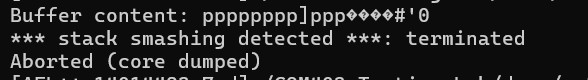

# Automatic testing -- fuzzing

This week's exercise wil focus on automated testing. We have prepared 4 simple programs which you will attempt to find bugs for.

Recall the concept of fuzzing : given a program to be tested, a fuzzer will attempt different inputs (at random, or not), to try to make the program crash. The fuzzer's goal is to find the largest amount of such inputs. This can be helpful for programmers to try and find bugs in their code, but it can also be used by attackers to find bugs in other's people code (which can then become starting points for potential exploits!).

# Setup

The `demo` folder contains all the source code for the different programs. 


## Docker installation

If you're on Linux or WSL, and don't want to use Dockers, you can install [AFL](https://github.com/google/AFL/) and compile it manually. Note that you might need to export many of the environmnet variables, that we assume exist in your environment (e.g.: `$AFL_PATH` holds the path to the install directory). If you're not entirely sure of what you're doing exactly, please use the Docker image we provide. If you want to continue running your code with a local `AFL` install, you can get the source for the programs by cloning the [following repo](https://github.com/kdsjZh/COM402-Testing-Lab/tree/master).

For other windows users, and MAC users, you will need to use Docker. Refer to [this](https://docs.docker.com/engine/install/) for Docker installation instructions.

The `docker` folder contains the Dockerfile used to build the image:

```bash
docker build -t com402/testing:2024 docker/
```

Then, after the build has complete, you can enter a Docker container built from this image using

```bash
docker run -it com402/testing:2024 /bin/bash
```


# Ex. 1

The first program (`ex1.c`) is very simple: it reads a file (given as program argument) as input, parses the file content as a `size` variable, and then simply reads `size` bytes in a buffer. 

The experienced C programmer in you immediately recognizes the issue! Since the buffer is of size `MAX_BUFFER_SIZE`, what would happen if $\texttt{size} > \texttt{MAX\_BUFFER\_SIZE}$ ? That's right, a buffer overflow (which will eventually make the program crash).

While it was easy for you to directly spot the bug in this toy program, you can easily imagine that if this happened in a much larger project, finding the issue might not have been that straightforward.

We will therefore showcase how to setup a fuzzer, namely [AFL](https://github.com/google/AFL/) (which has been used to [find real bugs/exploits in real software](https://aflplus.plus/#trophies)), to automatically try to find such buggy inputs, which would make the program crash.


Out of the box, you can you AFL to perform black box fuzzing on any program: 

```bash
$AFL_PATH/afl-fuzz -i input/path -o output/path -n  -- ./executable @@
```
where `-n` specifies that the binary should be fuzzed as is (black box, no additional information), `-o` specifies the directory where AFL will write its findings, `-i` - the directory with sample inputs. The fuzzer will use those sample inputs as "seeds" and try to find bugs starting from them. The `@@` at the end says that the inputs generated from the AFL have to be fed to the program as files -- if you want to fuzz programs which directly parse input from `stdin` you can omit it.

## Fuzz your first program!

Now, simply call `afl-fuzz` on the ex1 executable (you can obtain it by running `make clean && make ex1`).

The fuzzer will show you it's current status, as well as a bunch of statistics surrounding it. Of note is the `saved crashes` number under the `overall results` section, which displays the number of crashes the fuzzer has caught. Recall that each crash potentially means a bug in the software, so we want this number to be as high as possible!

Let it run for a while and then stop it by pressing CTRL+C 


## Explore outputs (optional)

Go to the AFL outputs (`out/`) directory.

```bash
cd out/
ls
```
You will notice several files and directories. The folder we are interested in is `crashes/`. It contains one file for each crash the fuzzer has found. You can use `xxd` or `hexdump` to look at the crash-file's content :

```bash
xxh crashes/id\:000005\,sig\:06\,src\:000000\,time\:1141\,execs\:1764\,op\:havoc\,rep\:51
```

Alternatively, you can also recreate the crash by simply running the program 

```bash
cd ../
./ex1 out/crashes/id\:000005\,sig\:06\,src\:000000\,time\:1141\,execs\:1764\,op\:havoc\,rep\:51
```

Which indeed segfaults the program:



# Ex. 2

Now, let's take an ever so slightly more complex program, `ex2.c`. Look at its source code.

The only difference with `ex1.c` is that `ex2.c` imposes rules on the input -- the file must start with the `0xefbe` bytes. Try rerunning the fuzzer as before. Does it work?

You notice that even after 10 minutes, the fuzzer is unable to find a single crash. Let's resort to grey-box fuzzing.

Recall that in gray-box fuzzing, the fuzzer assumes it has additional knowledge about the executable (e.g.: execution path path that are taken, when and how) to generate "better" fuzzing values. Here, let's use coverage guided fuzzing, which takes informed decisions regarding the fuzzing values by looking maximising the percentage of code (branches) the value covers. 

To do this with `AFL`, we must recompile the application.

```bash
make clean
CC=$AFL_PATH/afl-cc make ex2 
```

Then, you can execute `AFL` again, this time **without** the `-n` flag, to tell `AFL` that it can use coverage as guidance instea of simply trying random values. Does the fuzzer manage to find any crashing values? If yes, verify that the crash it found is correctly formatted, i.e. it starts by `0xbeef`. (recall that, depending on endianness, this will be stored as `0xef`,`0xbe`, hence the reverse-order comparison).


# Ex. 3

`ex3.c` is very similar to `ex2.c`, except the constraint on the input is bigger: now, we must have several magic bytes that match at the beginning of the file -- namely, it should start by `0xdeadbeeef`. Try coverage fuzzing this executable.

Does it work? 

It turns out that, although rather simple, this constraint is already sufficiently complex to hugely increase the time it would take for the fuzzer to find an adequate crashing value. 

We can however still do something about it by using [CmpLog](https://www.ndss-symposium.org/wp-content/uploads/2019/02/ndss2019_04A-2_Aschermann_paper.pdf), a technique developed which extracts the compared value from the register register and fills it back into the (fuzzed) input. 

To enable compile, recompile the program using

```bash
make clean
CC=afl-cc make ex3 && mv ex3 ex3.afl
CC=afl-cc AFL_LLVM_CMPLOG=1 make ex3 && mv ex3 ex3.cmplog
```

Then, instruct `AFL` to use complog data by running it with 

```bash
$AFL_PATH/afl-fuzz -i in/ -o out/ -c ./ex3.cmplog -l 3 -- ./ex3.afl @@
```

Verify that the crashes it has found start by the correct magic bytes.


## Ex. 4
Finally, `ex4.c`'s executable is the same as `ex2.c` with the only difference that the buffer now resides on the heap (it is `malloc`ed), rather than residing on the stack. What does this change?

<details>
  <summary>Answer</summary>
  
  The program will not crash directly due to stack-smashing detection. If there are no crashes, then our fuzzer will not be able to detect correct fuzzing values. 
  
</details>

To alleviate this, we will compile the program using [ASAN](https://clang.llvm.org/docs/AddressSanitizer.html), an adress sanitizer for heap, which will terminate the program on any adress violation.

```bash
make clean 
CC=afl-cc AFL_USE_ASAN=1 make ex4
```

Can you now find a crashing value for the program using `AFL`?

